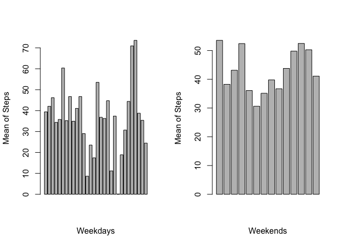

# Reproducible Research: Peer Assessment 1


## 1. Loading and preprocessing the data


```r
dt <- read.table(unz("activity.zip", "activity.csv"), header = TRUE, sep = ",", stringsAsFactors = F)
dt$date <- as.Date(dt$date)
```

## 2. Histogram of the total number of steps taken each day


```r
dt1 <- na.omit(dt)
stepsByDay <- aggregate(steps ~ date, dt1, sum)
hist(stepsByDay$steps, main = "Total number of steps taken each day", xlab = "Number of Steps")
```

<!-- -->

## 3. What is mean and median of total number of steps taken per day?


```r
mean_steps <- mean(stepsByDay$steps)
median_steps <- median(stepsByDay$steps)
```
The mean of the steps is 1.0766189\times 10^{4} and the median is 10765

## 4. Time series plot of the average number of steps taken


```r
stepsByinterval <- aggregate(steps ~ interval, dt1, mean)
plot(stepsByinterval, type = "l", main = "Time series of average number steps")
```

<!-- -->

## 5. The 5-minute interval that, on average, contains the maximum number of steps


```r
dt1 <- na.omit(dt)
head(dt1[order(dt1$steps, decreasing = TRUE), ],1)
```

```
##       steps       date interval
## 16492   806 2012-11-27      615
```

## 6. Code to describe and show a strategy for imputing missing data


```r
dt1 <- na.omit(dt)
```

## 7. Histogram of the total number of steps taken each day after missing values are imputed


```r
dt1 <- na.omit(dt)
stepsByDay <- aggregate(steps ~ date, dt1, sum)
hist(stepsByDay$steps, main = "Total number of steps taken each day")
```

<!-- -->


## 8. Panel plot comparing the average number of steps taken per 5-minute interval across weekdays and weekends


```r
library(lubridate)
dt1$weekday <- wday(dt1$date, label = TRUE)
dt1_weekend <- dt1[dt1$weekday %in% c("Sun", "Sat"), ]
dt1_weekday <- dt1[dt1$weekday %in% c("Mon", "Tue", "Wed", "Thurs", "Fri"), ]

dt1_weekend_mean <- aggregate(steps~date, dt1_weekend, mean)
dt1_weekday_mean <- aggregate(steps~date, dt1_weekday, mean) 

par(mfrow= c(1,2))
barplot(dt1_weekday_mean$steps, xlab = "Weekdays", ylab = "Mean of Steps")
barplot(dt1_weekend_mean$steps, xlab = "Weekends", ylab = "Mean of Steps")
```

<!-- -->


